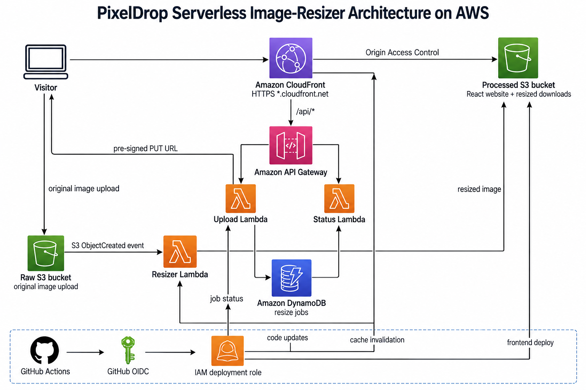
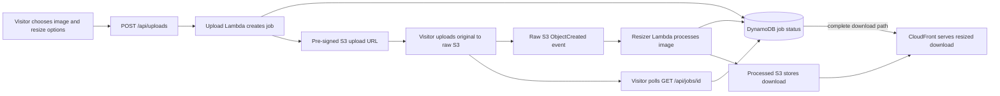
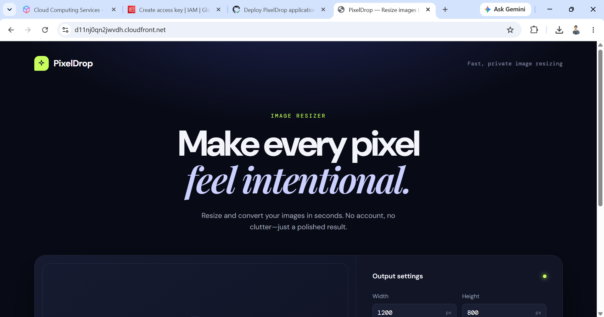
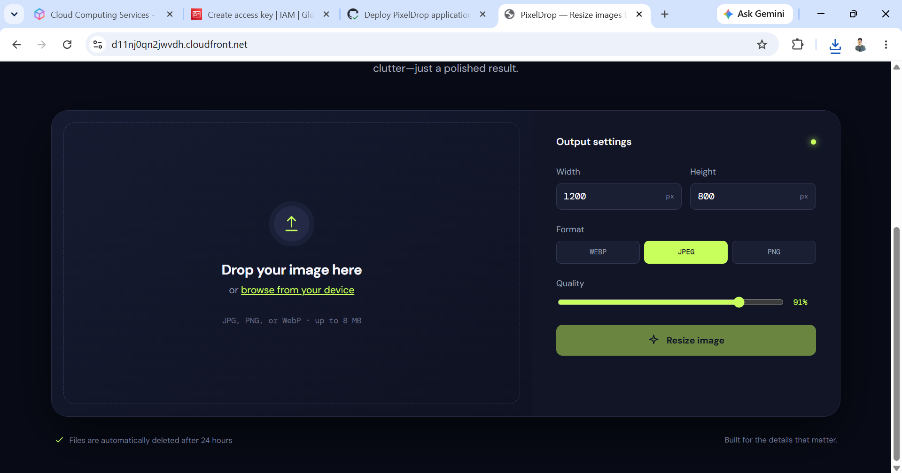
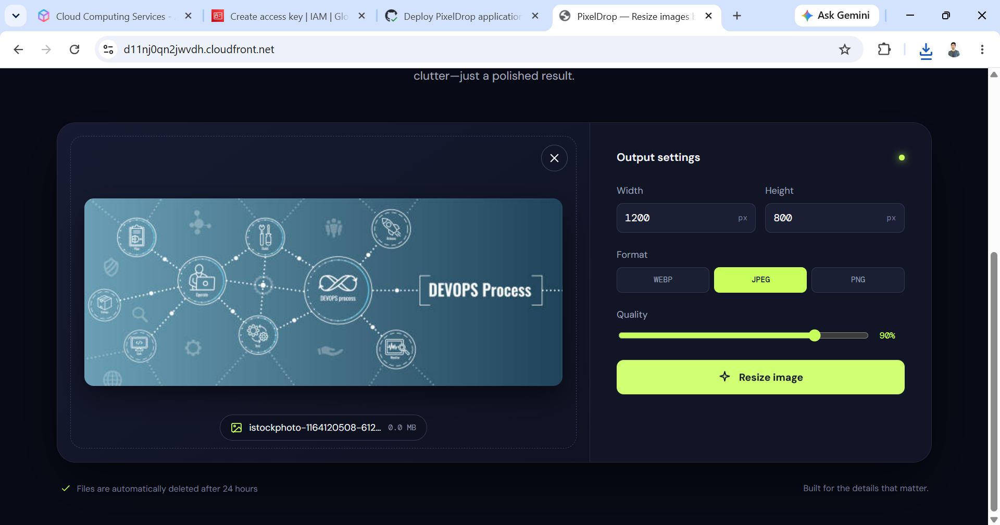
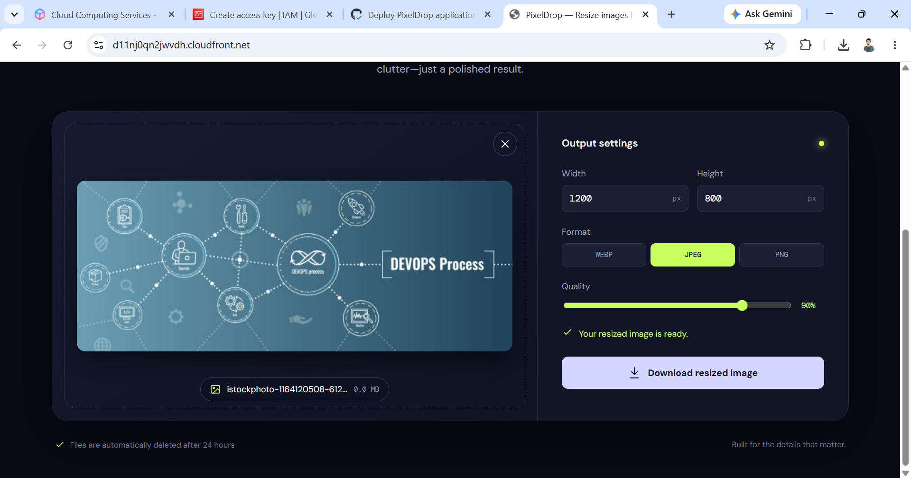
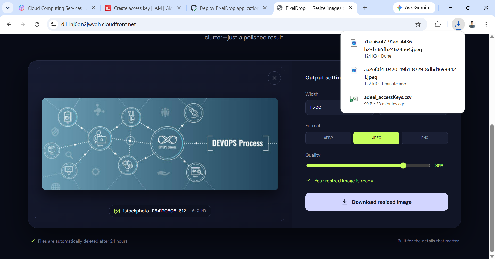

# PixelDrop — Serverless Image Resizer on AWS

<p align="center">
  <strong>Resize, convert, and download images through a polished serverless web experience.</strong>
</p>

<p align="center">
  
  
  
  
</p>

PixelDrop is an image-resizing website built as a practical cloud project. A visitor uploads a JPEG, PNG, or WebP image, selects dimensions, format, and quality, then downloads the processed result. The browser never sends the file through a traditional application server: it uploads safely to S3 through a short-lived pre-signed URL.

## Architecture

<p align="center">
  
</p>

## Why this project is interesting

| User experience | Serverless platform | Delivery |
| --- | --- | --- |
| Responsive React interface, direct uploads, resize progress, and download action | Private S3 buckets, Lambda, DynamoDB, API Gateway, CloudFront, lifecycle deletion | Terraform modules plus a GitHub Actions application-release workflow using OIDC |

- Original and generated files expire after 24 hours to limit storage cost and retention.
- Only CloudFront can read the processed/web bucket; the raw upload bucket remains private.
- DynamoDB tracks the state transition from `waiting` to `processing`, `complete`, or `failed`.
- GitHub Actions uses temporary OIDC credentials—no long-lived AWS access keys need to be stored in GitHub.

## Application flow



## Website screenshots

| Dashboard | Select an image |
| --- | --- |
|  |  |

| Resize settings | Processing complete |
| --- | --- |
|  |  |

| Downloaded result |
| --- |
|  |

## Start here

```text
1. Provision the AWS platform           → infra/
2. Configure repository Actions values  → app/
3. Push application changes             → GitHub Actions deploys them automatically
```

| Directory | Purpose |
| --- | --- |
| [infra/](infra/README.md) | Terraform for the AWS platform, GitHub OIDC trust, outputs, first deployment, and cleanup. |
| [app/](app/README.md) | React frontend and Lambda backend. The deployment workflow lives at the repository root. |
| [Architecture/](Architecture/) | Architecture image and application-flow Mermaid source. |
| [screenshots/](screenshots/) | Browser screenshots captured after deployment. |

## Project flow

```text
Terraform apply → AWS platform and GitHub OIDC role ready → push app source
                → GitHub Actions builds React + Lambda package → S3 + Lambda deployment
                → CloudFront cache invalidation → visitors see the release
```

Want to deploy the same project? Start with the [infrastructure manual](infra/README.md), then continue to the [application delivery guide](app/README.md).
